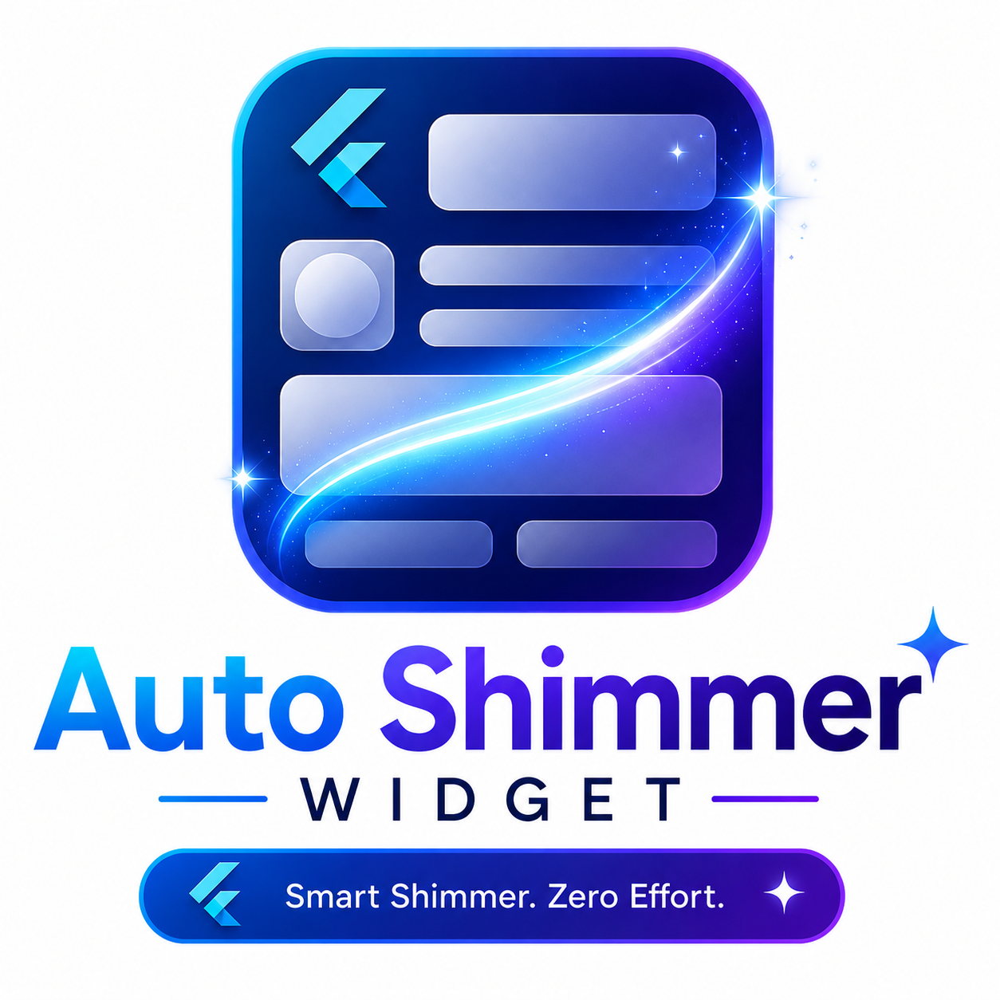
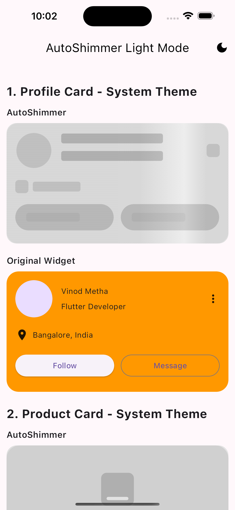
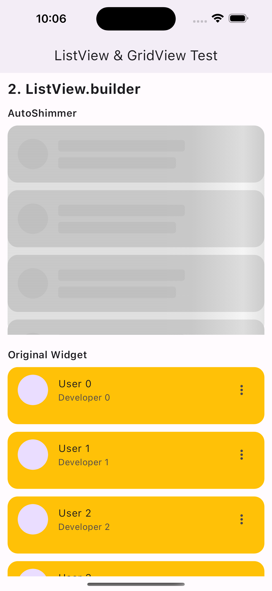
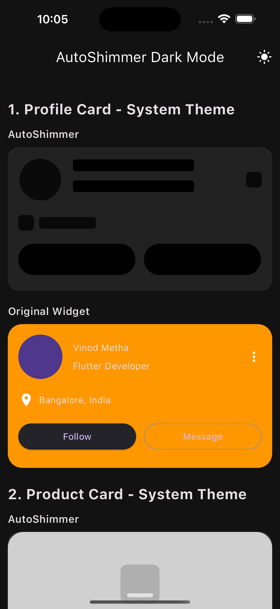
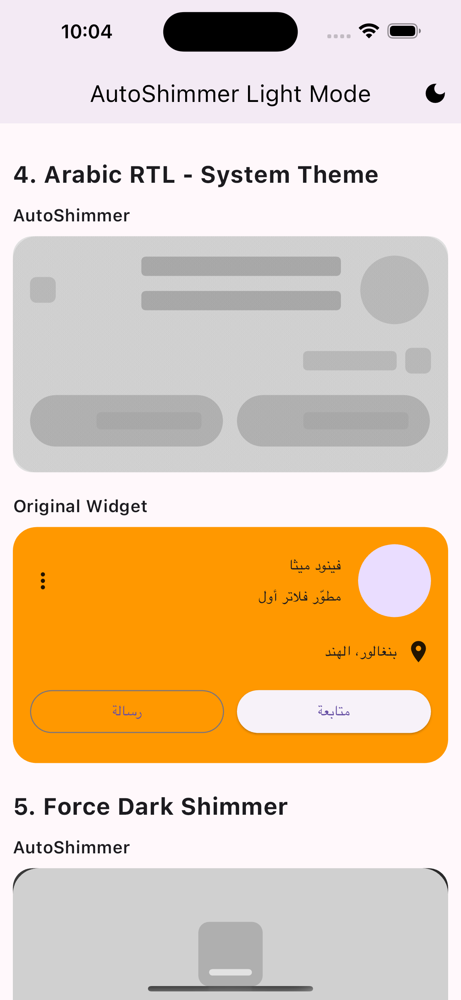
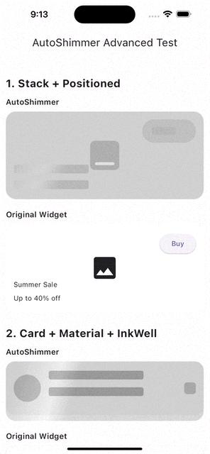

# Auto Shimmer Widget ✨

<p align="center">
  
</p>

<p align="center">
  <b>Automatically generate beautiful shimmer skeleton loaders from your existing Flutter widgets.</b>
</p>

<p align="center">
  <a href="https://pub.dev/packages/auto_shimmer_widget">
    
  </a>
  <a href="https://pub.dev/packages/auto_shimmer_widget/score">
    
  </a>
  
  
</p>

---

## Preview

### Light Mode

<p align="center">
  
  
</p>

### Dark Mode + Arabic RTL

<p align="center">
  
  
</p>

### Demo

<p align="center">
  <video src="media/auto_shimmer_demo.mp4" controls width="700"></video>
</p>

<p align="center">
  
</p>

---

## Why Auto Shimmer Widget?

Most Flutter apps need loading skeletons. Normally you create a separate skeleton widget for every real widget.

With `auto_shimmer_widget`, you write your UI once:

```dart
AutoShimmer(
  isLoading: true,
  child: ProfileCard(),
)
```

The package automatically reads your widget structure and paints a matching shimmer skeleton.

- No duplicate loading UI.
- No repetitive skeleton code.
- Cleaner Flutter development.

---

## Features

- Automatic shimmer skeleton generation from existing widgets
- `ListView`, `ListView.builder`, `GridView`, and `GridView.builder` support
- `Container`, `Row`, `Column`, `Stack`, `Positioned`, `ListTile`, `Card`, `Wrap`, `Chip`
- `Image`, `Icon`, `CircleAvatar`, `Text`, `RichText`, `TextField`
- Buttons: `ElevatedButton`, `OutlinedButton`, `TextButton`, `IconButton`, `FloatingActionButton`
- Dark mode support
- Arabic / RTL support
- Multiple animation types
- Custom speed, colors, direction, radius, item count, and grid count
- RenderObject-based custom painter approach

---

## Installation

Add this to your `pubspec.yaml`:

```yaml
dependencies:
  auto_shimmer_widget: ^0.0.1
```

Then run:

```bash
flutter pub get
```

Import it:

```dart
import 'package:auto_shimmer_widget/auto_shimmer_widget.dart';
```

---

## Basic Usage

```dart
AutoShimmer(
  isLoading: true,
  child: Container(
    height: 120,
    decoration: BoxDecoration(
      color: Colors.orange,
      borderRadius: BorderRadius.circular(16),
    ),
    child: const ListTile(
      leading: CircleAvatar(),
      title: Text('Vinod Metha'),
      subtitle: Text('Flutter Developer'),
    ),
  ),
)
```

When loading is completed:

```dart
AutoShimmer(
  isLoading: false,
  child: ProfileCard(),
)
```

---

## Profile Card Example

```dart
class ProfileCard extends StatelessWidget {
  const ProfileCard({super.key});

  @override
  Widget build(BuildContext context) {
    return Container(
      height: 220,
      padding: const EdgeInsets.all(16),
      decoration: BoxDecoration(
        color: Colors.orange,
        borderRadius: BorderRadius.circular(22),
      ),
      child: Column(
        children: [
          Row(
            children: const [
              CircleAvatar(radius: 34),
              SizedBox(width: 16),
              Expanded(
                child: Column(
                  crossAxisAlignment: CrossAxisAlignment.start,
                  children: [
                    Text('Vinod Metha'),
                    SizedBox(height: 8),
                    Text('Senior Flutter Developer'),
                  ],
                ),
              ),
              Icon(Icons.more_vert),
            ],
          ),
          const SizedBox(height: 20),
          Row(
            children: const [
              Icon(Icons.location_on),
              SizedBox(width: 8),
              Text('Bangalore, India'),
            ],
          ),
          const SizedBox(height: 20),
          Row(
            children: [
              Expanded(
                child: ElevatedButton(
                  onPressed: null,
                  child: Text('Follow'),
                ),
              ),
              SizedBox(width: 12),
              Expanded(
                child: OutlinedButton(
                  onPressed: null,
                  child: Text('Message'),
                ),
              ),
            ],
          ),
        ],
      ),
    );
  }
}
```

Use with shimmer:

```dart
AutoShimmer(
  child: const ProfileCard(),
)
```

---

## ListView Example

```dart
AutoShimmer(
  shimmerItemCount: 6,
  child: SizedBox(
    height: 330,
    child: ListView(
      physics: const NeverScrollableScrollPhysics(),
      children: const [
        ListTile(
          leading: CircleAvatar(),
          title: Text('Vinod'),
          subtitle: Text('Flutter Developer'),
          trailing: Icon(Icons.more_vert),
        ),
        ListTile(
          leading: CircleAvatar(),
          title: Text('Rahul'),
          subtitle: Text('Backend Developer'),
          trailing: Icon(Icons.more_vert),
        ),
        ListTile(
          leading: CircleAvatar(),
          title: Text('Sneha'),
          subtitle: Text('UI Designer'),
          trailing: Icon(Icons.more_vert),
        ),
      ],
    ),
  ),
)
```

---

## ListView.builder Example

If `itemCount` is not available, AutoShimmer uses `shimmerItemCount`.

```dart
AutoShimmer(
  shimmerItemCount: 6,
  child: SizedBox(
    height: 360,
    child: ListView.builder(
      physics: const NeverScrollableScrollPhysics(),
      itemCount: 6,
      itemBuilder: (context, index) {
        return Container(
          height: 90,
          margin: const EdgeInsets.only(bottom: 12),
          decoration: BoxDecoration(
            color: Colors.orange,
            borderRadius: BorderRadius.circular(18),
          ),
          child: ListTile(
            leading: const CircleAvatar(),
            title: Text('User $index'),
            subtitle: Text('Developer $index'),
            trailing: const Icon(Icons.more_vert),
          ),
        );
      },
    ),
  ),
)
```

---

## GridView.builder Example

```dart
AutoShimmer(
  shimmerItemCount: 6,
  gridCrossAxisCount: 2,
  child: SizedBox(
    height: 520,
    child: GridView.builder(
      physics: const NeverScrollableScrollPhysics(),
      itemCount: 6,
      gridDelegate: const SliverGridDelegateWithFixedCrossAxisCount(
        crossAxisCount: 2,
        crossAxisSpacing: 12,
        mainAxisSpacing: 12,
        childAspectRatio: 0.78,
      ),
      itemBuilder: (context, index) {
        return Container(
          decoration: BoxDecoration(
            color: Colors.orange,
            borderRadius: BorderRadius.circular(20),
          ),
          child: Column(
            crossAxisAlignment: CrossAxisAlignment.start,
            children: [
              Container(
                height: 120,
                width: double.infinity,
                decoration: const BoxDecoration(
                  color: Colors.white,
                  borderRadius: BorderRadius.vertical(
                    top: Radius.circular(20),
                  ),
                ),
                child: const Icon(Icons.image, size: 44),
              ),
              Padding(
                padding: const EdgeInsets.all(12),
                child: Text('Product $index'),
              ),
              Padding(
                padding: const EdgeInsets.symmetric(horizontal: 12),
                child: Text('₹${999 + index * 500}'),
              ),
            ],
          ),
        );
      },
    ),
  ),
)
```

---

## Product Card Example

```dart
AutoShimmer(
  child: Container(
    height: 330,
    decoration: BoxDecoration(
      color: Colors.orange,
      borderRadius: BorderRadius.circular(24),
    ),
    child: Column(
      crossAxisAlignment: CrossAxisAlignment.start,
      children: [
        Container(
          height: 160,
          width: double.infinity,
          decoration: const BoxDecoration(
            color: Colors.white,
            borderRadius: BorderRadius.vertical(
              top: Radius.circular(24),
            ),
          ),
          child: const Icon(Icons.image, size: 60),
        ),
        const Padding(
          padding: EdgeInsets.all(16),
          child: Column(
            crossAxisAlignment: CrossAxisAlignment.start,
            children: [
              Text('Premium Wireless Headphone'),
              SizedBox(height: 8),
              Text('Noise cancellation | 40hr battery'),
              SizedBox(height: 18),
              Text('₹4,999'),
            ],
          ),
        ),
      ],
    ),
  ),
)
```

---

## Animation Types

```dart
AutoShimmer(
  animationType: ShimmerAnimationType.slide,
  child: YourWidget(),
)
```

Available animation types:

```dart
ShimmerAnimationType.slide
ShimmerAnimationType.pulse
ShimmerAnimationType.wave
ShimmerAnimationType.bounce
ShimmerAnimationType.breathe
ShimmerAnimationType.glow
ShimmerAnimationType.none
```

### Pulse

```dart
AutoShimmer(
  animationType: ShimmerAnimationType.pulse,
  speed: const Duration(milliseconds: 900),
  child: YourWidget(),
)
```

### Wave

```dart
AutoShimmer(
  animationType: ShimmerAnimationType.wave,
  speed: const Duration(milliseconds: 1200),
  child: YourWidget(),
)
```

### Glow

```dart
AutoShimmer(
  animationType: ShimmerAnimationType.glow,
  speed: const Duration(milliseconds: 1300),
  child: YourWidget(),
)
```

---

## Animation Direction

```dart
AutoShimmer(
  direction: ShimmerDirection.startToEnd,
  child: YourWidget(),
)
```

Available directions:

```dart
ShimmerDirection.leftToRight
ShimmerDirection.rightToLeft
ShimmerDirection.startToEnd
ShimmerDirection.endToStart
ShimmerDirection.topToBottom
ShimmerDirection.bottomToTop
ShimmerDirection.topLeftToBottomRight
ShimmerDirection.topRightToBottomLeft
ShimmerDirection.bottomLeftToTopRight
ShimmerDirection.bottomRightToTopLeft
```

### Diagonal shimmer

```dart
AutoShimmer(
  animationType: ShimmerAnimationType.wave,
  direction: ShimmerDirection.topLeftToBottomRight,
  child: YourWidget(),
)
```

---

## Speed Control

```dart
AutoShimmer(
  speed: const Duration(milliseconds: 700),
  child: YourWidget(),
)
```

Slow shimmer:

```dart
AutoShimmer(
  speed: const Duration(milliseconds: 1800),
  child: YourWidget(),
)
```

---

## Custom Colors

```dart
AutoShimmer(
  baseColor: const Color(0xFFD8D8D8),
  highlightColor: const Color(0xFFF8F8F8),
  child: YourWidget(),
)
```

---

## Dark Mode Support

AutoShimmer can automatically detect app theme brightness.

```dart
AutoShimmer(
  themeMode: ShimmerThemeMode.system,
  child: YourWidget(),
)
```

Force dark shimmer:

```dart
AutoShimmer(
  themeMode: ShimmerThemeMode.dark,
  child: YourWidget(),
)
```

Force light shimmer:

```dart
AutoShimmer(
  themeMode: ShimmerThemeMode.light,
  child: YourWidget(),
)
```

Customize dark colors:

```dart
AutoShimmer(
  themeMode: ShimmerThemeMode.dark,
  darkBaseColor: const Color(0xFF2A2A2A),
  darkHighlightColor: const Color(0xFF3A3A3A),
  child: YourWidget(),
)
```

---

## RTL / Arabic Support

AutoShimmer supports RTL-aware shimmer direction and RTL-aware layout parsing.

```dart
Directionality(
  textDirection: TextDirection.rtl,
  child: AutoShimmer(
    direction: ShimmerDirection.startToEnd,
    child: ArabicProfileCard(),
  ),
)
```

Or manually pass direction:

```dart
AutoShimmer(
  textDirection: TextDirection.rtl,
  direction: ShimmerDirection.startToEnd,
  child: ArabicProfileCard(),
)
```

Arabic example:

```dart
AutoShimmer(
  textDirection: TextDirection.rtl,
  direction: ShimmerDirection.startToEnd,
  child: Directionality(
    textDirection: TextDirection.rtl,
    child: Container(
      height: 220,
      padding: const EdgeInsets.all(16),
      decoration: BoxDecoration(
        color: Colors.orange,
        borderRadius: BorderRadius.circular(22),
      ),
      child: Column(
        children: [
          Row(
            children: const [
              CircleAvatar(radius: 34),
              SizedBox(width: 16),
              Expanded(
                child: Column(
                  crossAxisAlignment: CrossAxisAlignment.start,
                  children: [
                    Text('فينود ميثا'),
                    SizedBox(height: 8),
                    Text('مطوّر فلاتر أول'),
                  ],
                ),
              ),
              Icon(Icons.more_vert),
            ],
          ),
        ],
      ),
    ),
  ),
)
```

---

## Theme Toggle Example

```dart
class ShimmerThemeDemo extends StatefulWidget {
  const ShimmerThemeDemo({super.key});

  @override
  State<ShimmerThemeDemo> createState() => _ShimmerThemeDemoState();
}

class _ShimmerThemeDemoState extends State<ShimmerThemeDemo> {
  bool isDark = false;

  @override
  Widget build(BuildContext context) {
    return MaterialApp(
      themeMode: isDark ? ThemeMode.dark : ThemeMode.light,
      theme: ThemeData.light(),
      darkTheme: ThemeData.dark(),
      home: Scaffold(
        appBar: AppBar(
          title: const Text('AutoShimmer Demo'),
          actions: [
            IconButton(
              icon: Icon(isDark ? Icons.light_mode : Icons.dark_mode),
              onPressed: () {
                setState(() => isDark = !isDark);
              },
            ),
          ],
        ),
        body: AutoShimmer(
          themeMode: ShimmerThemeMode.system,
          child: const ProfileCard(),
        ),
      ),
    );
  }
}
```

---

## Full API

```dart
AutoShimmer({
  Key? key,
  required Widget child,
  bool isLoading = true,
  int shimmerItemCount = 6,
  int gridCrossAxisCount = 2,
  ShimmerAnimationType animationType = ShimmerAnimationType.slide,
  Duration speed = const Duration(milliseconds: 1200),
  Color? baseColor,
  Color? highlightColor,
  Color lightBaseColor = const Color(0xFFE0E0E0),
  Color lightHighlightColor = const Color(0xFFF5F5F5),
  Color darkBaseColor = const Color(0xFF2A2A2A),
  Color darkHighlightColor = const Color(0xFF3A3A3A),
  ShimmerThemeMode themeMode = ShimmerThemeMode.system,
  ShimmerDirection direction = ShimmerDirection.startToEnd,
  TextDirection? textDirection,
  double borderRadius = 18,
})
```

---

## Supported Widgets

| Category | Widgets |
|---|---|
| Layout | `Container`, `Padding`, `SizedBox`, `Center`, `Align`, `Row`, `Column`, `Stack`, `Positioned`, `Wrap` |
| Scroll | `SingleChildScrollView`, `ListView`, `ListView.builder`, `GridView`, `GridView.builder` |
| Material | `Card`, `Material`, `InkWell`, `GestureDetector`, `ListTile` |
| Content | `Text`, `RichText`, `Icon`, `Image`, `CircleAvatar` |
| Forms | `TextField`, `TextFormField` |
| Actions | `ElevatedButton`, `OutlinedButton`, `TextButton`, `IconButton`, `FloatingActionButton` |
| Others | `Chip`, `ActionChip`, `FilterChip`, `ChoiceChip`, `InputChip`, `Divider`, `VerticalDivider`, `AspectRatio` |

---

## Limitations

Auto skeleton generation is based on widget-structure heuristics. For very custom or highly dynamic layouts, the generated skeleton may not be pixel-perfect.

Recommended approach:

```dart
AutoShimmer(
  child: CommonSimpleWidget(),
)
```

For complex custom UIs, you can still build a manual skeleton if needed.

---

## Best Practices

- Wrap your shimmer widget with a fixed height when using scrollables.
- Use `NeverScrollableScrollPhysics` for nested list/grid previews.
- Use `shimmerItemCount` for `ListView.builder` fallback.
- Use `gridCrossAxisCount` for `GridView.builder` fallback.
- Use `ShimmerDirection.startToEnd` for multilingual apps.
- Use `ShimmerThemeMode.system` for automatic dark/light support.

---

## Example App

Check the `/example` folder for:

- Basic card examples
- ListView examples
- GridView examples
- Product card examples
- Arabic RTL examples
- Dark mode examples
- Animation examples

---

## Contributing

Contributions are welcome.

You can help by:

- Reporting bugs
- Adding widget support
- Improving skeleton accuracy
- Improving documentation
- Adding examples

---

## License

This package is available under the MIT License.

---

## Author

Made with ❤️ by **Vinod Metha**

Flutter Developer | Package Author
